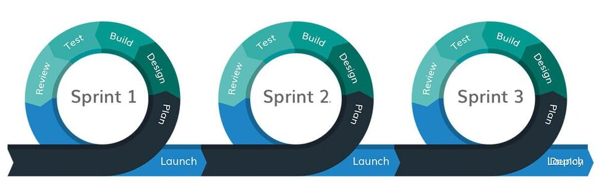

# Agile development

> What is agile?

Agile is `an iterative approach` to project management and software development
that helps teams deliver value to their customers faster and with fewer
headaches. Instead of betting everything on a "big bang" launch, an agile team
delivers work in `small`, but consumable, increments. Requirements, plans, and
results are evaluated continuously so teams have a natural mechanism for
responding to change quickly.

Being agile is about `learning from mistakes` and constantly `improving`, all
the details exist to make that possible The most important part of an agile
project is the retrospective, it's when you learn from your mistakes and make
better plans for the future During this module, your group's retrospective will
be the most important deliverable!

1. [All about trees](../deliverables/all-about-trees/README.md)

2. [Loruki](../deliverables/loruki-rebuild.md)

3. [HYF](../deliverables/hyf-redesign.md)

## Steps

1. set up the `repo`

   - use this
     [template](https://github.com/HackYourFutureBelgium/template-html-css) to
     create a new repo on your class origination.
   - add collaborators.
   - turn on `discussions` and give them `write` access.
   - turn on `gitHub` pages.
   - protect `main/master` branch.

2. project definition
   - what is your project about?
   - everyone in the team should know and agree about what they are building.
   - should be added at the main `README.md`
3. constrains
   - restriction that defines a project's limitations.
   - can be internal or external.
4. communication plan
   - how the team will communicate?
   - how you will stay in touch?
5. user personas
   - user personas are semi-fictional characters that represent different areas
     of your target audience, user base or stakeholder group
   - [semrush](https://www.semrush.com/persona/new/)
6. backlog
   - collections of user stories
   - Must have
   - should have
   - could have
7. design( wireframe)
   - a wireframe is a simplified drawing of what your website will look like.
8. development strategy
   - translating your `Must have` user stories to coding tasks.
   - You can do `should have` and `could have` after finishing all `Must have`
     stories(if you have time).
9. development
   - start working on `coding tasks` according to your `development strategy`
10. retrospective
    - a retrospective is meant for looking back at how the project went and
      learning what to do differently next time. An incomplete project with a
      great retrospective is still a success.
